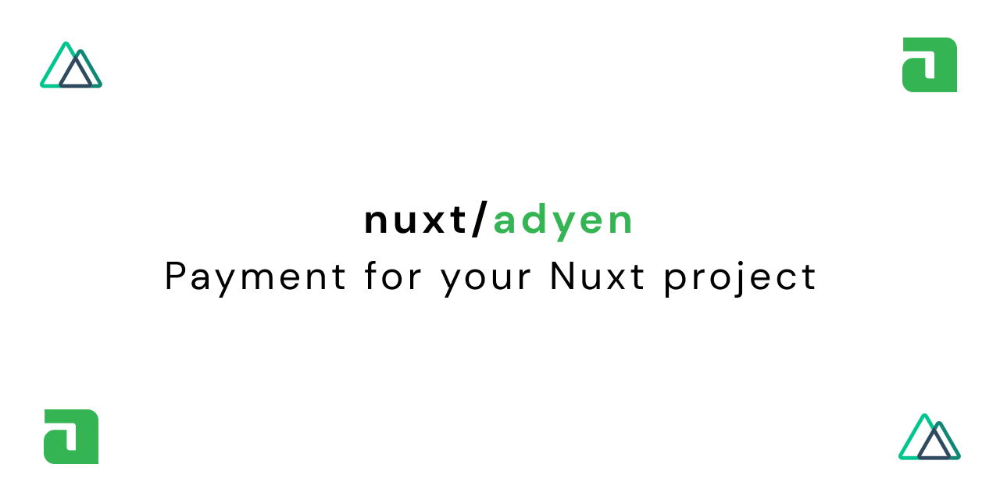

<!-- <p align="center">
  
</p> -->

# on-screen-keyboard-detector-nuxt

[![npm version][npm-version-src]][npm-version-href]
[![npm downloads][npm-downloads-src]][npm-downloads-href]
[![Github Actions CI][github-actions-ci-src]][github-actions-ci-href]
[![Codecov][codecov-src]][codecov-href]
[![License][license-src]][license-href]

> On Sceren Keyboard Detector for Nuxt.js

[📖 **Release Notes**](./CHANGELOG.md)

## Setup

1. Add `on-screen-keyboard-detector-nuxt` dependency to your project

```bash
yarn add on-screen-keyboard-detector-nuxt # or npm install on-screen-keyboard-detector-nuxt
```

2. Add `on-screen-keyboard-detector-nuxt` to the `modules` section of `nuxt.config.js`

```js
/// nuxt.config.js
{
  modules: [
    'on-screen-keyboard-detector-nuxt',
  ]
}
```

Or a separate section `on-screen-keyboard-detector-nuxt` for module options:

```js
// nuxt.config.js
{
  modules: [
    'on-screen-keyboard-detector-nuxt',
  ],
}
```

Usage

```
$keyboard.show
```

## Documentation

Move to the `docs` directory:

```bash
cd docs
```

Install dependencies and start the project in development mode:

```bash
yarn && yarn dev
```

## Development

1. Clone this repository
2. Install dependencies using `yarn install` or `npm install`
3. Start development server using `npm run dev`

## License

[MIT License](./LICENSE)

<!-- Badges -->
[npm-version-src]: https://img.shields.io/npm/v/on-screen-keyboard-detector-nuxt/latest.svg
[npm-version-href]: https://npmjs.com/package/on-screen-keyboard-detector-nuxt

[npm-downloads-src]: https://img.shields.io/npm/dt/on-screen-keyboard-detector-nuxt.svg
[npm-downloads-href]: https://npmjs.com/package/on-screen-keyboard-detector-nuxt

[github-actions-ci-src]: https://github.com/stonega/on-screen-keyboard-detector-nuxt/actions/workflows/ci.yml/badge.svg
[github-actions-ci-href]: https://github.com/stonega/on-screen-keyboard-detector-nuxt/actions/workflows/ci.yml

[codecov-src]: https://img.shields.io/codecov/c/github/stonega/on-screen-keyboard-detector-nuxt.svg
[codecov-href]: https://codecov.io/gh/stonega/on-screen-keyboard-detector-nuxt

[license-src]: https://img.shields.io/npm/l/on-screen-keyboard-detector-nuxt.svg
[license-href]: https://npmjs.com/package/on-screen-keyboard-detector-nuxt
